# Nordvik Fastigheter – Hyresgästportal med felanmälan

Lösningen är en molnbaserad portal där hyresgäster kan skicka in felanmälningar
med bild och beskrivning. Portalen sparar anmälningarna säkert i Azure, skickar
automatiskt en notis till förvaltaren och skapar en post i en SharePoint-lista.

## Repo

Länk till GitHub-repo: https://github.com/01ponpih/AZURE-MOV25

### modul1 – Azure Function

| Fil | Beskrivning |
| :--- | :--- |
| `function_app.py` | Blob-trigger som skickar felanmälningar till Power Automate |
| `main.bicep` | Skapar Function-container och roller |
| `Dockerfile` | Paketerar Function-koden som container |
| `host.json` | Konfiguration för Function Host |
| `requirements.txt` | Python-beroenden |
| `deploy.sh` | Bygger, pushar och deployar Function-containern |

### modul2 – Webbapp och infrastruktur

| Fil | Beskrivning |
| :--- | :--- |
| `app.py` | Flask-app som tar emot felanmälningar |
| `Dockerfile` | Bygger webbappens container |
| `main.bicep` | Skapar nätverk, storage, ACR, Log Analytics, Container App och identiteter |
| `requirements.txt` | Python-beroenden |
| `deploy.sh` | Bygger, pushar och deployar webbappen |

## Del A – Centrala Azure-tjänster och virtualiseringsnivåer

### Compute

Portalen körs som container på Azure Container Apps. Ärendehanteringen
använder Azure Functions som programmeringsmodell, körd som container i samma
miljö.

Container Apps valdes för webbappen eftersom den ger snabb skalning, stöd för
VNet och kan köra vilken container som helst. Azure Functions valdes för
ärendehanteringen eftersom den triggas av händelser och bara kostar när den
körs. En KEDA Cron-scaler håller en replik igång mellan 06-22 och skalar till noll övriga timmar. Se Delmoment 6 för hur akuta ärenden hanteras mellan 22-06.

### Nätverk

Lösningen använder ett VNet (`vnet-nordvik`) med två subnät:

| Subnät | Används för | NSG | Service Endpoint |
| :--- | :--- | :--- | :--- |
| `snet-aca` | Container Apps-miljön | `nsg-aca` | Microsoft.Storage |
| `snet-pe` | Förberett för Private Endpoint | – | – |

NSG:n på `snet-aca` tillåter endast port 80 och 443 in från internet.
All annan trafik nekas av Azures default-regel.

### Storage

Lagringen sker i Azure Blob Storage med två containers: en för felanmälningar
och en för kontrakt och besiktningsprotokoll. En Lifecycle Management-regel
flyttar kontrakt automatiskt till en billigare lagringsnivå efter 90 dagar.
Se Delmoment 4 för detaljer.

### Virtualiseringsnivåer

| Nivå | Vad man hanterar | Kostnad | Skalbarhet |
| :--- | :--- | :--- | :--- |
| VM | Operativsystem, patchar, nätverk, app | Fast timkostnad dygnet runt | Manuell |
| Container | App och beroenden | Per instans, kan skalas till noll | Automatisk |
| Serverless | Endast koden | Per körning | Automatisk |

**VM** kör en hel dator i molnet. Man ansvarar för operativsystemet och betalar
för maskinen även när ingen använder den.

**Container** paketerar appen med allt den behöver. Den startar snabbare än en
VM och kan skalas automatiskt. Container Apps kan gå ner till noll instanser
när ingen trafik finns.

**Serverless** innebär att man bara laddar upp koden och molnet sköter resten.
Man betalar endast för den tid koden körs.

### Val av nivå för Nordvik

Portalen körs som container på Azure Container Apps. Ärendehanteringen använder Azure Functions som programmeringsmodell vilket är samma händelsestyrda kod som annars körs på en traditionell serverless-plan, men paketerad i en container och körd i samma Container Apps-miljö. Funktionen skalar till noll under natten och kostar bara när den körs, precis som en vanlig serverless funktion.

Valet grundar sig i Nordviks trafikmönster:

- 5 till 10 samtidiga användare normalt, upp till 120 vid månadsskiften
- Nära noll trafik mellan kl. 00 och 06
- 70 felanmälningar per dygn i snitt, men upp till 300 vid en vattenläcka

En VM hade krävt manuell dimensionering för toppbelastning och kostat dygnet
runt. Container Apps skalar automatiskt och kan köra två repliker för att
uppfylla kravet att tåla att en instans faller bort. Function-koden körs som
container i samma miljö och kostar bara under de timmar den är aktiv.

## Delmoment 1 – Compute

Webbappen driftsätts som en Docker-container på Azure Container Apps.
Containern bygger på en Flask-app som hanterar formuläret, validerar indata
och sparar felanmälningar som JSON i Blob Storage.

Miljön körs med två repliker under dagtid för att uppfylla kravet på
99,5 % tillgänglighet och för att tåla att en instans faller bort. Vid hög
belastning skalas miljön automatiskt upp till tio repliker.

Under natten skalas portalen till noll för att undvika kostnad för tomgång.
En HTTP-scaler gör att portalen startar automatiskt vid första request,
vilket tar 10 till 30 sekunder. Efterföljande requests hanteras snabbt
eftersom repliken då är igång.

Ärendehanteringen körs som en Function i samma Container Apps-miljö. En KEDA
Cron-scaler håller en replik igång mellan 06 till 22 och
skalar till noll övriga timmar.

Bilder över 3 MB komprimeras i webbläsaren innan de skickas in. En typisk
5 MB-bild blir 300 till 800 KB. Detta håller nere både bandbredd och
lagringsvolym.

## Delmoment 2 – IAM

### Roller

| Roll | Behörighet | Varför |
| :--- | :--- | :--- |
| Förvaltare | Storage Blob Data Contributor på storage-kontot | Hanterar felanmälningar |
| Ekonomi | Storage Blob Data Reader på storage-kontot | Läsande insyn |

Rollerna tilldelas via Entra-grupperna `Nordvik-Fastighet` och
`Nordvik-Ekonomi` istället för enskilda användare. Det gör det enkelt att lägga till eller ta bort åtkomst för nya medarbetare.

Även om förvaltare och ekonomi har roller på storage-kontot, sker deras dagliga arbete via SharePoint-listan. Storage-kontot är stängt för åtkomst utanför VNet (defaultAction: Deny), vilket innebär att rollerna på storage främst fungerar som dataskyddslager snarare än som daglig åtkomstväg. SharePoint-listan är den kanal där förvaltning och ekonomi faktiskt arbetar.

### Managed Identities

Lösningen använder två separata managed identities:

| Identitet | Typ | Roller |
| :--- | :--- | :--- |
| `id-nordvik-web` | User-Assigned | AcrPull, Storage Blob Data Contributor på containern |
| `id-nordvik-func` | User-Assigned | AcrPull, Storage Blob Data Owner, Queue Data Contributor, Table Data Contributor, Storage Account Contributor |

Funktionens identitet har rollen Storage Account Contributor utöver de tre data-plane-rollerna. Rollen lades till under utvecklingen eftersom blob-triggern gav AuthorizationPermissionMismatch utan den. Det är inte verifierat om rollen är strikt nödvändig eller om felet berodde på något annat, men den behölls för att säkerställa att flödet fungerar.

Rollen ger bredare behörigheter än minsta principen kräver, inklusive möjlighet att lista och återaktivera lagringskontots delade nycklar. Risken begränsas av att allowSharedKeyAccess: false är satt – nycklarna kan inte användas för autentisering även om de listas. En framtida utbyggnad bör testa om rollen kan tas bort helt, eftersom blob-triggerns behov av kontrollplansbehörigheter varierar mellan olika konfigurationer.

Webbappen och Function Appen delar inte identitet. Detta begränsar effekten om
en av dem skulle komprometteras.

Function-identiteten behöver de fyra storage-rollerna eftersom blob-triggern
internt använder både blobbar, köer och tabeller för att hålla reda på vilka
filer som redan behandlats.

### Avgränsning: hyresgästens inloggning

Uppgiften beskriver att hyresgäster loggar in och ser sina egna anmälningar.
Att bygga en sån sida för 5 500 hyresgäster tolkade jag som ligger utanför kursens scope.

Lösningen jag gjorde är att hyresgästen får istället ett unikt referensnummer vid inskick och ett bekräftelsemejl med ärendets uppgifter. Det ger ett konkret sätt att hänvisa till ärendet vid kontakt med förvaltningen.

En förenklad Mina ärenden-sida hade kanske varit möjlig att bygga, men
skulle innebära att vem som helst med länken kan se en hyresgästs
personuppgifter. Jag valde därför att inte försöka bygga den delen utan istället bygga en säker lösning.

I en produktionsmiljö hade inloggning med BankID eller liknande varit en bra
lösning, kopplad till varje hyresgäst.

## Delmoment 3 – Nätverk och säkerhet

Storage-kontot är konfigurerat med `defaultAction: 'Deny'`. Endast trafik från
subnätet `snet-aca` tillåts via en Service Endpoint. All annan trafik nekas på
nätverksnivå.

NSG:n `nsg-aca` tillåter endast:

| Prioritet | Regel | Port | Källa |
| :--- | :--- | :--- | :--- |
| 100 | Allow-HTTPS-Inbound | 443 | Internet |
| 110 | Allow-HTTP-Inbound | 80 | Internet |
| 120 | Allow-AzureLoadBalancer | Alla | AzureLoadBalancer |

Övrig trafik nekas av Azures default-regel 65500.

Defense in depth uppnås genom fyra nivåer:

1. **Nätverksnivå:** NSG på subnätet, Service Endpoint och `defaultAction: 'Deny'` på storage
2. **Identitetsnivå:** Managed Identity och RBAC med minsta behörighet
3. **Datanivå:** Inga delade nycklar, ingen publik åtkomst
4. **Transportnivå:** TLS 1.2, HTTPS-only

Screenshots:

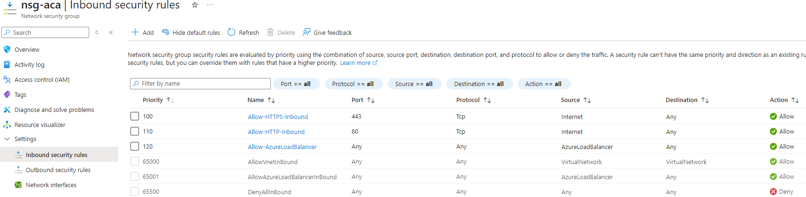
*NSG-regler som tillåter endast port 80 och 443.*

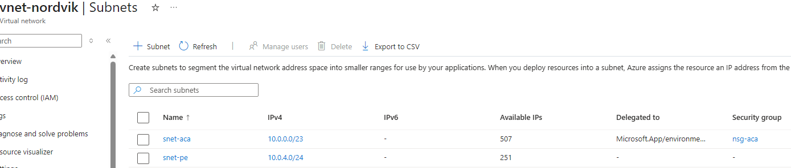
*Segmentering av nätverket i två subnät.*

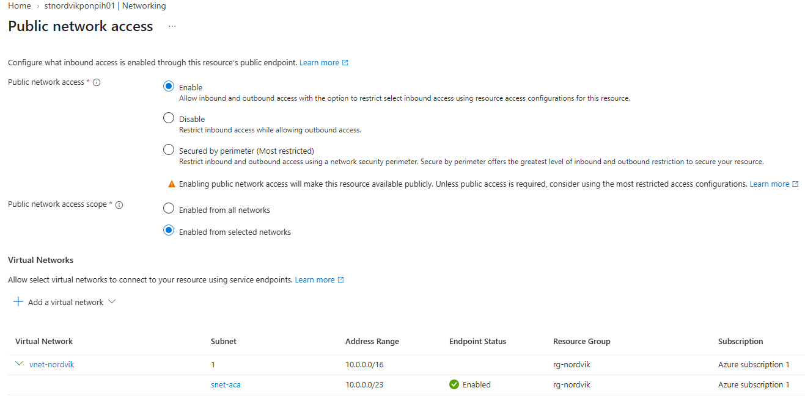
*Storage-kontot tillåter endast trafik från VNet.*

## Delmoment 4 – Storage

Lagringen sker i ett storage-konto med två containers:

| Container | Innehåll | Lagringsnivå |
| :--- | :--- | :--- |
| `felanmalningar` | JSON med metadata och base64-kodad bild | Hot |
| `kontrakt` | Kontrakt och besiktningsprotokoll | Hot, flyttas till Cool efter 90 dagar |

En Lifecycle Management-regel flyttar automatiskt filer i `kontrakt` från Hot
till Cool efter 90 dagar. Nordviks kontrakt läses sällan efter de tre första
månaderna, så detta sänker lagringskostnaden avsevärt.

Storage-kontot är konfigurerat med:

- `allowBlobPublicAccess: false` – ingen anonym åtkomst
- `allowSharedKeyAccess: false` – inga delade nycklar
- `minimumTlsVersion: 'TLS1_2'` – modern kryptering
- `supportsHttpsTrafficOnly: true` – endast HTTPS
- `defaultAction: 'Deny'` – endast VNet-trafik tillåts


### Verifiering

Flödet verifieras genom att skicka in en felanmälan via webbformuläret.

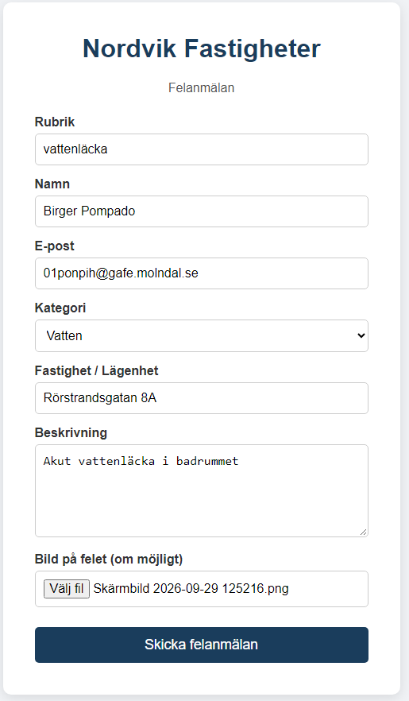

*Webbformuläret med ifyllda uppgifter.*

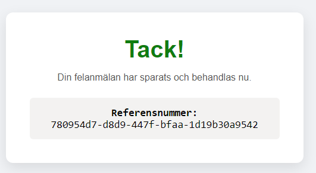

*Användaren får ett referensnummer direkt.*

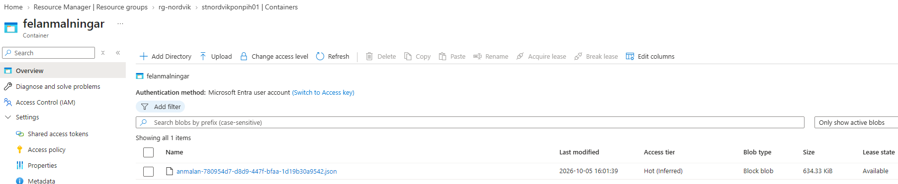
*Felanmälan sparas som JSON i containern felanmalningar.*

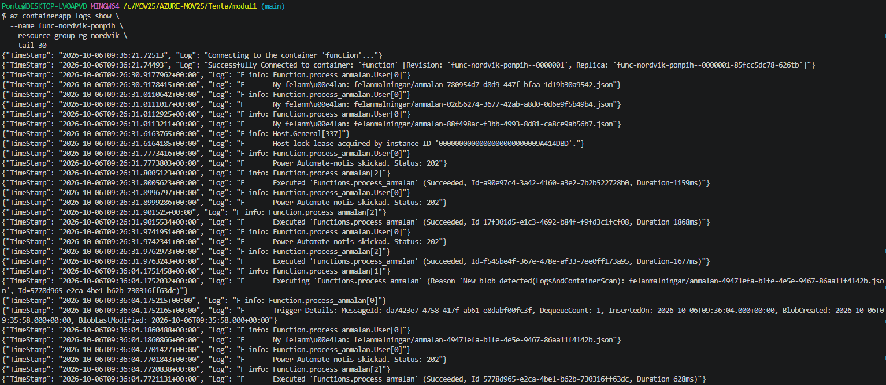
*Function-containern triggas av den nya filen och skickar vidare till Power Automate.*

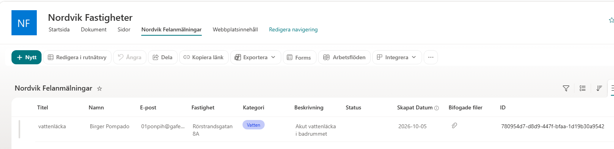
*Posten skapas i SharePoint-listan.*

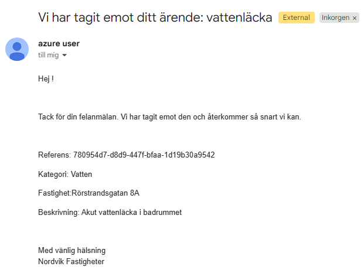

*Hyresgästen får ett bekräftelsemejl.*

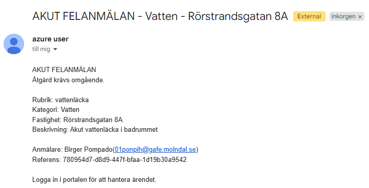
*Akuta ärenden ger ett prioriterat mejl till jouren.*

## Delmoment 5 – IaC

All infrastruktur skapas med Bicep. Bicep kompileras automatiskt till ARM-templates vid deployment. Den genererade ARM-JSON-filen kan skapas med az bicep build --file main.bicep om så önskas. Lösningen är uppdelad i två moduler:

- `modul2/main.bicep` skapar VNet, NSG, storage, ACR, Log Analytics, Container
  Apps Environment, User-Assigned Managed Identity och webbappen
- `modul1/main.bicep` skapar Function-containern, en separat identitet och dess
  roller

Alla resurser har taggarna `Company`, `Environment`, `CostCenter`,
`Fastighet` och `ManagedBy`. Taggen `Fastighet` är satt till `Alla` eftersom
portalen delas av samtliga fastigheter. En framtida utbyggnad skulle kunna
taggas per fastighet om varje fastighet fick en egen resursgrupp.

Projektnamnet är parametriserat via `projectName`, vilket gör att hela
lösningen kan deployas med ett annat namn för test eller demo. Globalt unika
namn som ACR och storage är separata parametrar eftersom de måste vara unika i
hela Azure.

Rolltilldelningarna till Entra-grupperna görs via Azure CLI i deploy.sh istället för via Bicep. Detta är en medveten avvägning eftersom rolltilldelningar mot Entra-grupper kräver att grupperna existerar innan deploymenten körs.

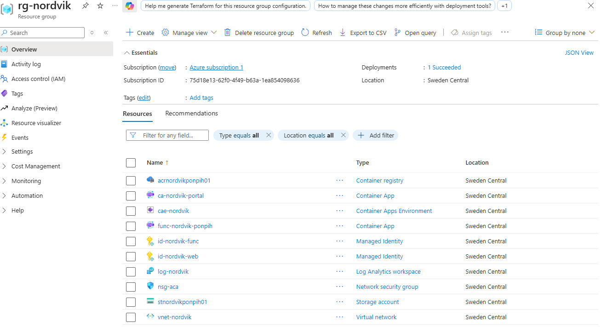
*Samtliga resurser som skapats av Bicep-mallarna.*

### Deployment

Modulerna körs i denna ordning eftersom modul1 är beroende av modul2.

**Modul 2** – skapar infrastruktur och webbapp
   ```bash
   cd modul2
   bash deploy.sh
   ```
   **Modul 1** – skapar Function-containern och kopplar den till lagringskontot
   ```bash
   cd ../modul1
export POWER_AUTOMATE_WEBHOOK_URL="https://..."
bash deploy.sh
   ```

## Delmoment 6 – Automation och integration
Power Automate-flödet är konfigurerat manuellt i Power Platform och är inte en del av Bicep-deploymenten. Detta beror på att Power Automate inte kan provisioneras med ARM eller Bicep.

1. **Container App** tar emot felanmälan
2. **Blob Storage** sparar filen
3. **Function** triggas av den nya filen
4. **Power Automate** tar emot anropet och gör tre saker:
   - Skapar en post i SharePoint
   - Skickar bekräftelsemejl till hyresgästen
   - Skickar notismejl till förvaltaren (akut eller vanligt)

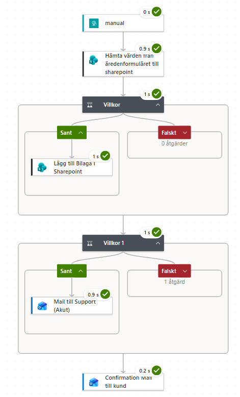 

### SharePoint-lista

Listan `Nordvik Felanmälningar` har kolumnerna Titel, Namn, E-post, Kategori,
Fastighet, Beskrivning, Status, Skapat Datum, Bifogade Filer och ID.

| Roll | Behörighet |
| :--- | :--- |
| Nordvik-Fastighet | Redigera |
| Nordvik-Ekonomi | Läsa |
| Övriga | Ingen åtkomst |

### Outlook-mejl

| Typ | Mottagare | När |
| :--- | :--- | :--- |
| Bekräftelse | Hyresgäst | Alltid |
| Akut notis | Jour | Värme, Vatten, Lås |
| Vanlig notis | Förvaltning | El, Övrigt |

Akuta ärenden får ämnesraden `AKUT:` och hög prioritet.

### Kanaler för akuta ärenden

Funktionen körs endast mellan 06 till 22 via KEDA
Cron-scaler för att undvika kostnad för tomgång nattetid. Akuta ärenden som
kommer in under natten hanteras därför genom att hyresgästen ringer jouren direkt. Portalen fungerar som komplement och samlar in data även under natten. Mejlet till förvaltningen skickas
kl. 06 när funktionen startar igen.

Denna lösning uppfyller Nordviks krav att inte betala för oanvänd kapacitet. En lösning med minReplicas: 1 dygnet runt hade kostat cirka 150 kr
extra per månad utan att tillföra något för de ärenden som faktiskt kräver
omedelbar hantering, eftersom dessa ändå hanteras per telefon.

Enda nackdelen skulle ju vara att personen som svarar behöver ta emot uppgifter manuellt än att få allting automatiskt framför sig men det är ganska liten uppoffring speciellt då denna typen av akuta samtal är väldigt ovanliga.

Av min erfarenhet av att jobba som jour under natttid så är det standard att vid verkligt akuta ärenden få ett samtal, oftast som nattarbetare har man väldigt lite att göra och det är inte alltid man stirrar konstant på skärmen och märker notisen direkt när den kommer, så samtal är också bäst för att få snabb hantering. 

#### Alternativa lösningar som valts bort:

**Händelsestyrd skalning.** Istället för en tidbaserad scaler hade funktionen kunnat skala upp från noll när ett meddelande hamnar i en lagringskö. Det hade gett omedelbar hantering dygnet runt till ungefär samma kostnad, men valdes bort eftersom det kräver en mer komplex lösning med lagringsköer. För Nordviks nuvarande ärendevolym under natten så funkar nuvarande lösningen bra.

**Direkt anrop från webbappen.** Webbappen hade kunnat anropa Power Automate direkt vid inskick av akuta ärenden, utan att gå via Function-containern. Detta valdes bort eftersom det hade gett två flöden för samma typ av data. Ett enda flöde är enklare att felsöka och underhålla.

## Delmoment 7 – Sammanfattning

Lösningen har planerats utifrån Nordviks verksamhetsunderlag och implementerats
enligt uppgiftens krav. All infrastruktur skapas med Bicep och kan återskapas
från repot genom att köra `deploy.sh` i respektive modul.

Händelsekedjan från hyresgästens inskick till förvaltarens notis integrerar
fem tjänster: Container Apps, Blob Storage, Azure Functions, Power Automate
och SharePoint.

### Avgränsningar

**Hyresgästinloggning:** Se Delmoment 2.

**Private Endpoint:** En Service Endpoint används istället för Private
Endpoint. Private Endpoint är tekniskt möjligt även med Container Apps, men
kräver en mer komplex nätverkstopologi med egna privata DNS-zoner för utgående
trafik. Service Endpoint löser samma krav, att lagringen inte är publikt
åtkomlig, utan den extra komplexiteten och kostnaden.

## VG – Motivering

### Kostnad

Portalen körs med två repliker under dagtid (06 till 22 alla dagar) för att
uppfylla tillgänglighetskravet, vilket kostar cirka 550 kr/mån. Under natten
skalas portalen till noll via en KEDA Cron-scaler, eftersom trafiken då är
nära noll. Function-containern körs en replik under samma tidsfönster och
kostar cirka 310 kr/mån. Storage, ACR och Log Analytics tillkommer med cirka
120 kr/mån. Total kostnad landar på cirka 980 kr/mån, vilket är under budgeten
på 2 500 kr.

En VM-lösning med samma tillgänglighet hade krävt minst två instanser och
kostat över 2 400 kr/mån utan att kunna skalas ner under natten.

Lifecycle Management flyttar kontrakt från Hot till Cool efter 90 dagar, vilket
sänker lagringskostnaden för de 40 GB som sällan läses. Bildkomprimeringen i
webbläsaren minskar bandbredd och lagringsvolym ytterligare.

### Skalbarhet

Container Apps skalar automatiskt mellan 0 och 10 repliker beroende på trafik.
Under dagtid (06 till 22) körs två repliker för att uppfylla
tillgänglighetskravet. Vid månadsskiften eller driftstörningar skalas miljön
upp till tio repliker via HTTP-scalern. Under natten skalas portalen till
noll, men vaknar automatiskt vid första request.

Function-containern kör en replik inom det aktiva fönstret (06 till 22) och
skalas till noll övriga tider.

En VM hade behövt dimensioneras för högsta förväntade belastning.

### Drift

Inga operativsystem att patcha. Inga nycklar eller connection strings i koden. Både portalen och Function-containern använder managed identity för att nå storage. Rollerna är begränsade till vad varje identitet behöver.

### Säkerhet

Defense in depth på fyra nivåer:

| Nivå | Åtgärd |
| :--- | :--- |
| Nätverk | NSG, Service Endpoint, `defaultAction: 'Deny'` på storage |
| Identitet | Managed Identity, RBAC med minsta behörighet |
| Data | Inga delade nycklar, ingen publik åtkomst |
| Transport | TLS 1.2, HTTPS-only |

Ärendehanteringen körs nu i samma VNet som webbappen. Det gjorde att vi kunde sätta defaultAction: 'Deny' på storage-kontot. Detta ger äkta nätverksisolering, till skillnad från en lösning där ärendehantering tvingas gå via publika endpoints.

### Provisionering som kod

All infrastruktur skapas med Bicep. Lösningen kan återskapas från repot genom att köra två skript. Enda undantaget är Power Automate-flödet och SharePoint-listan, som konfigureras manuellt eftersom de ligger i Power Platform och inte kan provisioneras med Bicep.

### Optimering

Nästa steg i en produktionsmiljö vore att byta Service Endpoint mot Private
Endpoint. Det är tekniskt möjligt även med Container Apps, men kräver en mer
komplex nätverkstopologi med egna privata DNS-zoner.                    


## Kod

All kod som används i lösningen. Filerna finns även i repot under respektive
modul-mapp.

### modul2/main.bicep

```bicep
@description('Azure-region för resurserna')
param location string = resourceGroup().location

@description('Projektnamn som används för att bygga resursnamn')
param projectName string = 'nordvik'

@description('Globalt unikt namn för Azure Container Registry')
param acrName string = 'acrnordvikponpih01'

@description('Globalt unikt namn för storage account')
param storageAccountName string = 'stnordvikponpih01'

@description('Image-tag för portalen')
param imageName string = 'nordvik-portal:latest'

@description('Sätts till true i steg 2 av deploy.sh efter att imagen byggts och pushats.')
param deployApp bool = false

@description('Taggar som appliceras på alla resurser')
param tags object = {
  Company: 'Nordvik'
  Environment: 'Production'
  CostCenter: 'Forvaltning'
  Fastighet: 'Alla'
  ManagedBy: 'IaC'
}

// Resursnamn som byggs från projectName
var containerAppName = 'ca-${projectName}-portal'
var containerEnvName = 'cae-${projectName}'
var logAnalyticsWorkspaceName = 'log-${projectName}'
var identityName = 'id-${projectName}-web'
var vnetName = 'vnet-${projectName}'
var subnetAcaName = 'snet-aca'
var subnetPeName = 'snet-pe'
var nsgAcaName = 'nsg-aca'

// Fast GUID:n för inbyggda Azure-roller
var acrPullRoleId = '7f951dda-4ed3-4680-a7ca-43fe172d538d'
var blobDataContributorRoleId = 'ba92f5b4-2d11-453d-a403-e96b0029c9fe'

// NSG för Container Apps-subnätet
// Tillåter endast port 80 och 443 in från internet. Allt annat nekas.
resource nsgAca 'Microsoft.Network/networkSecurityGroups@2023-11-01' = {
  name: nsgAcaName
  location: location
  tags: tags
  properties: {
    securityRules: [
      {
        name: 'Allow-HTTPS-Inbound'
        properties: {
          description: 'HTTPS från internet till portalen'
          protocol: 'Tcp'
          sourcePortRange: '*'
          destinationPortRange: '443'
          sourceAddressPrefix: 'Internet'
          destinationAddressPrefix: '*'
          access: 'Allow'
          priority: 100
          direction: 'Inbound'
        }
      }
      {
        name: 'Allow-HTTP-Inbound'
        properties: {
          description: 'HTTP från internet (vidarebefordras till HTTPS)'
          protocol: 'Tcp'
          sourcePortRange: '*'
          destinationPortRange: '80'
          sourceAddressPrefix: 'Internet'
          destinationAddressPrefix: '*'
          access: 'Allow'
          priority: 110
          direction: 'Inbound'
        }
      }
      {
        name: 'Allow-AzureLoadBalancer'
        properties: {
          description: 'Krävs av Container Apps för health checks'
          protocol: '*'
          sourcePortRange: '*'
          destinationPortRange: '*'
          sourceAddressPrefix: 'AzureLoadBalancer'
          destinationAddressPrefix: '*'
          access: 'Allow'
          priority: 120
          direction: 'Inbound'
        }
      }
    ]
  }
}

// VNet med snet-aca (Container Apps) och snet-pe (förberett för Private Endpoint)
resource vnet 'Microsoft.Network/virtualNetworks@2023-11-01' = {
  name: vnetName
  location: location
  tags: tags
  properties: {
    addressSpace: {
      addressPrefixes: [ '10.0.0.0/16' ]
    }
    subnets: [
      {
        name: subnetAcaName
        properties: {
          addressPrefix: '10.0.0.0/23'
          delegations: [
            {
              name: 'aca-delegation'
              properties: {
                serviceName: 'Microsoft.App/environments'
              }
            }
          ]
          serviceEndpoints: [
            { service: 'Microsoft.Storage' }
          ]
          networkSecurityGroup: {
            id: nsgAca.id
          }
        }
      }
      {
        name: subnetPeName
        properties: {
          addressPrefix: '10.0.4.0/24'
        }
      }
    ]
  }
}

resource subnetAca 'Microsoft.Network/virtualNetworks/subnets@2023-11-01' existing = {
  parent: vnet
  name: subnetAcaName
}

// Storage Account
// Service Endpoint på subnätet ger åtkomst via Azure-backbone.
resource storageAccount 'Microsoft.Storage/storageAccounts@2023-01-01' = {
  name: storageAccountName
  location: location
  tags: tags
  sku: { name: 'Standard_LRS' }
  kind: 'StorageV2'
  properties: {
    accessTier: 'Hot'
    allowBlobPublicAccess: false
    allowSharedKeyAccess: false
    minimumTlsVersion: 'TLS1_2'
    supportsHttpsTrafficOnly: true
    networkAcls: {
      defaultAction: 'Deny'
      bypass: 'AzureServices'
      virtualNetworkRules: [
        {
          id: subnetAca.id
          action: 'Allow'
        }
      ]
    }
  }
}

resource blobService 'Microsoft.Storage/storageAccounts/blobServices@2023-01-01' = {
  parent: storageAccount
  name: 'default'
}

resource felanmalningarContainer 'Microsoft.Storage/storageAccounts/blobServices/containers@2023-01-01' = {
  parent: blobService
  name: 'felanmalningar'
}

resource kontraktContainer 'Microsoft.Storage/storageAccounts/blobServices/containers@2023-01-01' = {
  parent: blobService
  name: 'kontrakt'
}

// Flyttar kontrakt till Cool-lagringsnivå efter 90 dagar
resource lifecyclePolicy 'Microsoft.Storage/storageAccounts/managementPolicies@2023-01-01' = {
  parent: storageAccount
  name: 'default'
  properties: {
    policy: {
      rules: [
        {
          name: 'kontrakt-till-cool'
          enabled: true
          type: 'Lifecycle'
          definition: {
            actions: {
              baseBlob: {
                tierToCool: { daysAfterModificationGreaterThan: 90 }
              }
            }
            filters: {
              blobTypes: [ 'blockBlob' ]
              prefixMatch: [ 'kontrakt/' ]
            }
          }
        }
      ]
    }
  }
}

resource acr 'Microsoft.ContainerRegistry/registries@2023-07-01' = {
  name: acrName
  location: location
  tags: tags
  sku: { name: 'Basic' }
  properties: { adminUserEnabled: false }
}

resource logAnalytics 'Microsoft.OperationalInsights/workspaces@2022-10-01' = {
  name: logAnalyticsWorkspaceName
  location: location
  tags: tags
  properties: {
    sku: { name: 'PerGB2018' }
    retentionInDays: 30
  }
}

resource managedEnv 'Microsoft.App/managedEnvironments@2023-05-01' = {
  name: containerEnvName
  location: location
  tags: tags
  properties: {
    appLogsConfiguration: {
      destination: 'log-analytics'
      logAnalyticsConfiguration: {
        customerId: logAnalytics.properties.customerId
        sharedKey: logAnalytics.listKeys().primarySharedKey
      }
    }
    vnetConfiguration: {
      infrastructureSubnetId: subnetAca.id
      internal: false
    }
  }
}

resource identity 'Microsoft.ManagedIdentity/userAssignedIdentities@2023-01-31' = {
  name: identityName
  location: location
  tags: tags
}

resource acrPullRole 'Microsoft.Authorization/roleAssignments@2022-04-01' = {
  name: guid(acr.id, identity.id, acrPullRoleId)
  scope: acr
  properties: {
    roleDefinitionId: subscriptionResourceId('Microsoft.Authorization/roleDefinitions', acrPullRoleId)
    principalId: identity.properties.principalId
    principalType: 'ServicePrincipal'
  }
}

resource blobDataContributorRole 'Microsoft.Authorization/roleAssignments@2022-04-01' = {
  name: guid(felanmalningarContainer.id, identity.id, blobDataContributorRoleId)
  scope: felanmalningarContainer
  properties: {
    roleDefinitionId: subscriptionResourceId('Microsoft.Authorization/roleDefinitions', blobDataContributorRoleId)
    principalId: identity.properties.principalId
    principalType: 'ServicePrincipal'
  }
}

resource containerApp 'Microsoft.App/containerApps@2023-05-01' = if (deployApp) {
  name: containerAppName
  location: location
  tags: tags
  identity: {
    type: 'UserAssigned'
    userAssignedIdentities: {
      '${identity.id}': {}
    }
  }
  properties: {
    managedEnvironmentId: managedEnv.id
    configuration: {
      activeRevisionsMode: 'Single'
      ingress: {
        external: true
        targetPort: 80
      }
      registries: [
        {
          server: acr.properties.loginServer
          identity: identity.id
        }
      ]
    }
    template: {
      containers: [
        {
          name: 'portal'
          image: '${acr.properties.loginServer}/${imageName}'
          resources: { cpu: json('0.5'), memory: '1.0Gi' }
          env: [
            { name: 'AZURE_STORAGE_BLOB_URL', value: storageAccount.properties.primaryEndpoints.blob }
            { name: 'AZURE_CLIENT_ID', value: identity.properties.clientId }
          ]
          probes: [
            {
              type: 'Liveness'
              httpGet: { path: '/health', port: 80 }
              initialDelaySeconds: 10
              periodSeconds: 30
            }
            {
              type: 'Readiness'
              httpGet: { path: '/health', port: 80 }
              periodSeconds: 10
            }
          ]
        }
      ]
      scale: {
        minReplicas: 0
        maxReplicas: 10
        rules: [
          {
            name: 'daytime'
            custom: {
              type: 'cron'
              metadata: {
                timezone: 'Europe/Stockholm'
                start: '0 6 * * *'
                end: '0 22 * * *'
                desiredReplicas: '2'
              }
            }
          }
          {
            name: 'http'
            http: {
              metadata: {
                concurrentRequests: '50'
              }
            }
          }
        ]
      }
    }
  }
  dependsOn: [ acrPullRole, blobDataContributorRole ]
}

output acrLoginServer string = acr.properties.loginServer
output storageAccountName string = storageAccount.name
output containerAppName string = deployApp ? containerApp!.name : ''
output containerAppFQDN string = deployApp ? containerApp!.properties.configuration.ingress.fqdn : ''
output logAnalyticsWorkspaceId string = logAnalytics.id
output identityClientId string = identity.properties.clientId
output nsgName string = nsgAca.name
```

### modul2/app.py

```python
import os
import json
import uuid
import datetime
import logging
import base64
from flask import Flask, request, render_template_string
from azure.identity import DefaultAzureCredential
from azure.storage.blob import BlobServiceClient

app = Flask(__name__)
app.config['MAX_CONTENT_LENGTH'] = 10 * 1024 * 1024  # 10 MB
logging.basicConfig(level=logging.INFO)

HTML_TEMPLATE = """
<!DOCTYPE html>
<html lang="sv">
<head>
    <meta charset="UTF-8">
    <title>Nordvik Fastigheter - Felanmälan</title>
    <style>
        body { font-family: sans-serif; background-color: #f0f2f5; margin: 0; padding: 20px; display: flex; justify-content: center; align-items: center; min-height: 100vh; }
        .container { background: #ffffff; padding: 40px; border-radius: 10px; box-shadow: 0 4px 15px rgba(0,0,0,0.1); width: 100%; max-width: 500px; box-sizing: border-box; }
        h1 { text-align: center; color: #1a3d5c; margin-top: 0; }
        p { text-align: center; color: #555; margin-bottom: 25px; }
        label { display: block; margin-top: 15px; font-weight: bold; color: #333; }
        input, textarea, select { width: 100%; padding: 10px; margin-top: 5px; box-sizing: border-box; border: 1px solid #ccc; border-radius: 5px; font-size: 1rem; }
        button { margin-top: 25px; width: 100%; padding: 12px 20px; background-color: #1a3d5c; color: white; border: none; border-radius: 5px; font-size: 1.1rem; cursor: pointer; transition: 0.2s; }
        button:hover { background-color: #12293d; }
        button:disabled { background-color: #8ba3b8; cursor: wait; }
        .error { color: #d13438; margin-top: 15px; font-weight: bold; text-align: center; }
        .jour-info { display: none; background: #fff4e5; border-left: 4px solid #ff8c00; padding: 12px 15px; margin-top: 15px; border-radius: 5px; font-size: 0.95rem; line-height: 1.5; }
        .jour-info strong { color: #b85c00; }
        .jour-info a { color: #1a3d5c; font-weight: bold; text-decoration: underline; }
        .success-box { background: #ffffff; padding: 40px; border-radius: 12px; box-shadow: 0 8px 24px rgba(0,0,0,0.1); text-align: center; max-width: 500px; width: 100%; box-sizing: border-box; }
        .success-box h1 { color: #107c10; font-size: 2.5rem; margin-top: 0; margin-bottom: 10px; }
        .ref-box { background: #f3f2f1; padding: 15px; border-radius: 6px; font-family: monospace; font-size: 1.1rem; color: #000; word-break: break-all; margin-top: 15px; }
    </style>
</head>
<body>
    
    <div class="success-box">
        <h1>Tack!</h1>
        <p>Din felanmälan har sparats och behandlas under dagen.</p>
        <div class="ref-box">
            <strong>Referensnummer:</strong><br>{{ success_id }}
        </div>
    </div>
    
    <div class="container">
        <h1>Nordvik Fastigheter</h1>
        <p>Felanmälan</p>
        <p class="error">{{ error_msg }}</p>
        <form method="POST" enctype="multipart/form-data" id="felanmalan-form">
            <label for="titel">Rubrik</label>
            <input type="text" id="titel" name="titel" required>

            <label for="namn">Namn</label>
            <input type="text" id="namn" name="namn" required>

            <label for="epost">E-post</label>
            <input type="email" id="epost" name="epost" required>

            <label for="kategori">Kategori</label>
            <select id="kategori" name="kategori" required>
                <option value="">Välj kategori</option>
                <option value="Värme">Värme</option>
                <option value="Vatten">Vatten</option>
                <option value="Lås">Lås</option>
                <option value="El">El</option>
                <option value="Övrigt">Övrigt</option>
            </select>

            <div id="jour-info" class="jour-info">
                <strong>Akut?</strong> Ring jouren direkt på
                <a href="tel:Nordviks Journummer">Nordviks Journummer</a> för snabbast hantering.
                Använd formuläret som komplement.
            </div>

            <label for="fastighet">Fastighet / Lägenhet</label>
            <input type="text" id="fastighet" name="fastighet" required>

            <label for="beskrivning">Beskrivning</label>
            <textarea id="beskrivning" name="beskrivning" rows="5" required></textarea>

            <label for="bild">Bild på felet (om möjligt)</label>
            <input type="file" id="bild" name="bild" accept="image/*">

            <button type="submit" id="submit-btn">Skicka felanmälan</button>
        </form>
    </div>
    

    <script>
    document.addEventListener('DOMContentLoaded', function () {
        const form = document.getElementById('felanmalan-form');
        if (!form) return;

        const kategoriSelect = document.getElementById('kategori');
        const jourInfo = document.getElementById('jour-info');
        const akutaKategorier = ['Värme', 'Vatten', 'Lås'];

        kategoriSelect.addEventListener('change', function () {
            jourInfo.style.display = akutaKategorier.includes(this.value) ? 'block' : 'none';
        });

        form.addEventListener('submit', async function (e) {
            const fileInput = document.getElementById('bild');
            const file = fileInput.files[0];

            if (!file || file.size < 3 * 1024 * 1024) return;

            e.preventDefault();
            const submitBtn = document.getElementById('submit-btn');
            submitBtn.disabled = true;
            submitBtn.textContent = 'Komprimerar bild...';

            try {
                const compressed = await komprimeraBild(file);
                const dataTransfer = new DataTransfer();
                dataTransfer.items.add(compressed);
                fileInput.files = dataTransfer.files;
            } catch (err) {
                console.error('Kunde inte komprimera bilden:', err);
            }

            form.submit();
        });
    });

    function komprimeraBild(file) {
        return new Promise((resolve, reject) => {
            const reader = new FileReader();
            reader.onerror = reject;
            reader.onload = function (ev) {
                const img = new Image();
                img.onerror = reject;
                img.onload = function () {
                    const MAX_DIM = 2000;
                    let width = img.width;
                    let height = img.height;

                    if (width > MAX_DIM || height > MAX_DIM) {
                        if (width > height) {
                            height = Math.round(height * MAX_DIM / width);
                            width = MAX_DIM;
                        } else {
                            width = Math.round(width * MAX_DIM / height);
                            height = MAX_DIM;
                        }
                    }

                    const canvas = document.createElement('canvas');
                    canvas.width = width;
                    canvas.height = height;
                    canvas.getContext('2d').drawImage(img, 0, 0, width, height);

                    canvas.toBlob(
                        function (blob) {
                            if (!blob) return reject(new Error('toBlob returnerade null'));
                            const nyttNamn = file.name.replace(/\.[^.]+$/, '') + '.jpg';
                            resolve(new File([blob], nyttNamn, { type: 'image/jpeg' }));
                        },
                        'image/jpeg',
                        0.75
                    );
                };
                img.src = ev.target.result;
            };
            reader.readAsDataURL(file);
        });
    }
    </script>
</body>
</html>
"""

@app.route("/health", methods=["GET"])
def health():
    return "OK", 200

@app.route("/", methods=["GET", "POST"])
def index():
    if request.method == "POST":
        arende_id = str(uuid.uuid4())
        titel = request.form.get("titel")
        namn = request.form.get("namn")
        epost = request.form.get("epost")
        kategori = request.form.get("kategori")
        fastighet = request.form.get("fastighet")
        beskrivning = request.form.get("beskrivning")

        has_attachment = False
        attachment_name = ""
        attachment_base64 = ""

        fil = request.files.get("bild")
        if fil and fil.filename != "":
            has_attachment = True
            attachment_name = fil.filename
            file_bytes = fil.read()
            attachment_base64 = base64.b64encode(file_bytes).decode('utf-8')

        payload = {
            "id": arende_id,
            "titel": titel,
            "namn": namn,
            "epost": epost,
            "kategori": kategori,
            "fastighet": fastighet,
            "beskrivning": beskrivning,
            "created": datetime.datetime.now(datetime.timezone.utc).isoformat().replace('+00:00', 'Z'),
            "has_attachment": has_attachment,
            "attachment_name": attachment_name,
            "attachment_content_base64": attachment_base64
        }

        blob_url = os.getenv("AZURE_STORAGE_BLOB_URL")

        try:
            if blob_url:
                credential = DefaultAzureCredential()
                blob_service_client = BlobServiceClient(account_url=blob_url, credential=credential)

                blob_client = blob_service_client.get_blob_client(
                    container="felanmalningar",
                    blob=f"anmalan-{arende_id}.json"
                )
                blob_client.upload_blob(json.dumps(payload), overwrite=True)

                return render_template_string(HTML_TEMPLATE, success_id=arende_id)
            else:
                return render_template_string(HTML_TEMPLATE, error_msg="Systemfel: Lagrings-URL saknas.")
        except Exception as e:
            app.logger.error(f"Kunde inte spara felanmälan: {e}")
            return render_template_string(HTML_TEMPLATE, error_msg="Ett fel uppstod när felanmälan skulle sparas. Försök igen.")

    return render_template_string(HTML_TEMPLATE)

if __name__ == "__main__":
    app.run(host="0.0.0.0", port=80)
```

### modul2/Dockerfile

```dockerfile
FROM python:3.11-slim
WORKDIR /app
COPY requirements.txt .
RUN pip install --no-cache-dir -r requirements.txt
COPY app.py .
EXPOSE 80
CMD ["gunicorn", "-b", "0.0.0.0:80", "app:app"]
```

### modul2/requirements.txt

```text
flask
azure-storage-blob
azure-identity
gunicorn
```

### modul2/deploy.sh

```bash
#!/bin/bash
set -e
export MSYS_NO_PATHCONV=1

RESOURCE_GROUP="${RESOURCE_GROUP:-rg-nordvik}"
LOCATION="swedencentral"
GROUP_NAME="Nordvik-Fastighet"
IMAGE_TAG="nordvik-portal:latest"

echo "0. Verifierar Azure-kontext..."
CURRENT_SUB=$(az account show --query name -o tsv 2>/dev/null || echo "")
if [ -z "$CURRENT_SUB" ]; then
  echo "Fel: Ingen aktiv Azure-prenumeration. Kör 'az login' först."
  exit 1
fi
echo "   Prenumeration: $CURRENT_SUB"

echo "0b. Säkerställer att resursgruppen finns..."
az group create --name "$RESOURCE_GROUP" --location "$LOCATION" -o none

echo "1. Steg 1: Infrastruktur, UAI och roller (utan app)..."
az deployment group create \
  --resource-group "$RESOURCE_GROUP" \
  --template-file main.bicep \
  --parameters deployApp=false -o none

ACR_SERVER=$(az deployment group show \
  --resource-group "$RESOURCE_GROUP" \
  --name main \
  --query properties.outputs.acrLoginServer.value -o tsv)

STORAGE_NAME=$(az deployment group show \
  --resource-group "$RESOURCE_GROUP" \
  --name main \
  --query properties.outputs.storageAccountName.value -o tsv)

ACR_NAME="${ACR_SERVER%%.*}"

echo "Infrastruktur klar! ACR: $ACR_SERVER | Storage: $STORAGE_NAME"
echo "Väntar på att storage-kontot registreras i Azure..."
for i in {1..6}; do
  if az storage account show --name "$STORAGE_NAME" --resource-group "$RESOURCE_GROUP" &>/dev/null; then
    echo "   Storage-kontot är tillgängligt."
    break
  fi
  echo "   Väntar ($i/6)..."
  sleep 10
done

echo "2. Tilldelar behörigheter till Entra ID-grupper..."

assign_role() {
  local GROUP_NAME="$1"
  local ROLE="$2"
  local SCOPE="$3"

  local GROUP_ID
  GROUP_ID=$(az ad group show --group "$GROUP_NAME" --query id -o tsv 2>/dev/null || echo "")

  if [ -z "$GROUP_ID" ]; then
    echo "   Varning: Gruppen '$GROUP_NAME' finns inte. Hoppar över."
    return
  fi

  local ROLE_OUTPUT
  ROLE_OUTPUT=$(az role assignment create \
    --assignee-object-id "$GROUP_ID" \
    --assignee-principal-type Group \
    --role "$ROLE" \
    --scope "$SCOPE" 2>&1) || true

  if echo "$ROLE_OUTPUT" | grep -qi "RoleAssignmentExists\|already exists"; then
    echo "   ($GROUP_NAME: $ROLE var redan tilldelad)"
  else
    echo "   $GROUP_NAME: $ROLE tilldelad."
  fi
}

RG_ID=$(az group show --name "$RESOURCE_GROUP" --query id -o tsv)
STORAGE_ID=$(az storage account show \
  --name "$STORAGE_NAME" \
  --resource-group "$RESOURCE_GROUP" \
  --query id -o tsv)

assign_role "Nordvik-fastighet" "Storage Blob Data Contributor" "$STORAGE_ID"
assign_role "Nordvik-fastighet" "Reader" "$RG_ID"
assign_role "Nordvik-Ekonomi" "Storage Blob Data Reader" "$STORAGE_ID"
assign_role "Nordvik-Ekonomi" "Reader" "$RG_ID"

echo "3. Bygger och pushar Docker-image..."
az acr login --name "$ACR_NAME"
docker build -t "$ACR_SERVER/$IMAGE_TAG" .
docker push "$ACR_SERVER/$IMAGE_TAG"

echo "4. Skapar Container App med retry-loop..."
APP_DEPLOYED=false
LAST_ERROR=""
for i in {1..10}; do
  echo "   Försök $i/10..."

  if LAST_ERROR=$(az deployment group create \
      --resource-group "$RESOURCE_GROUP" \
      --template-file main.bicep \
      --parameters deployApp=true imageName="$IMAGE_TAG" -o none 2>&1); then
    echo "   Appen utrullad!"
    APP_DEPLOYED=true
    break
  fi

  if ! echo "$LAST_ERROR" | grep -qi "unauthorized\|forbidden\|permission\|acrpull\|401\|403\|operation expired\|failed to provision"; then
    echo "   Felet verkar inte bero på rättighetspropagering. Avbryter."
    echo "$LAST_ERROR"
    exit 1
  fi

  echo "   Väntar 30 sekunder innan nästa försök..."
  sleep 30
done

if [ "$APP_DEPLOYED" = false ]; then
  echo "Fel: Kunde inte rulla ut Container Appen efter 10 försök."
  echo "Sista felmeddelande:"
  echo "$LAST_ERROR"
  exit 1
fi

APP_NAME=$(az deployment group show \
  --resource-group "$RESOURCE_GROUP" \
  --name main \
  --query properties.outputs.containerAppName.value -o tsv)

echo "5. Verifierar hälsostatus..."
APP_FQDN=$(az containerapp show \
  --name "$APP_NAME" \
  --resource-group "$RESOURCE_GROUP" \
  --query properties.configuration.ingress.fqdn -o tsv)

echo "Portalens URL: https://$APP_FQDN"

for i in {1..10}; do
  if curl -sf "https://$APP_FQDN/health" > /dev/null; then
    echo "   Health Check: OK (200 OK)"
    break
  fi
  echo "   Väntar på att portalen svarar ($i/10)..."
  sleep 10
done

echo "Modul 2 är klar!"
```

### modul1/main.bicep

```bicep
@description('Azure-region för resurserna')
param location string = resourceGroup().location

@description('Projektnamn som används för att bygga resursnamn')
param projectName string = 'nordvik'

@description('Globalt unikt namn för Function App (Container App)')
param functionAppName string = 'func-nordvik-ponpih'

@description('Globalt unikt namn för Azure Container Registry (från modul2)')
param acrName string = 'acrnordvikponpih01'

@description('Globalt unikt namn för storage account (från modul2)')
param storageAccountName string = 'stnordvikponpih01'

@description('Namn på Container Apps Environment (från modul2)')
param containerEnvName string = 'cae-nordvik'

@description('Image-tag för Function-containern')
param imageName string = 'nordvik-function:latest'

@description('Sätts till true i steg 2 av deploy.sh efter att imagen byggts och pushats.')
param deployFunction bool = false

@description('URL till Power Automate-flödet')
param powerAutomateWebhookUrl string = ''

@description('Taggar som appliceras på alla resurser')
param tags object = {
  Company: 'Nordvik'
  Environment: 'Production'
  CostCenter: 'Forvaltning'
  Fastighet: 'Alla'
  ManagedBy: 'IaC'
}

var identityName = 'id-${projectName}-func'

// Fast GUID:n för inbyggda Azure-roller
var acrPullRoleId = '7f951dda-4ed3-4680-a7ca-43fe172d538d'
var blobOwnerRoleId = 'b7e6dc6d-f1e8-4753-8033-0f276bb0955b'
var queueContributorRoleId = '974c5e8b-45b9-4653-ba55-5f855dd0fb88'
var tableContributorRoleId = '0a9a7e1f-b9d0-4cc4-a60d-0319b160aaa3'
var storageAccountContributorRoleId = '17d1049b-9a84-46fb-8f53-869881c3d3ab'

// Referenser till modul2-resurser
resource acr 'Microsoft.ContainerRegistry/registries@2023-07-01' existing = {
  name: acrName
}

resource storageAccount 'Microsoft.Storage/storageAccounts@2023-01-01' existing = {
  name: storageAccountName
}

resource containerEnv 'Microsoft.App/managedEnvironments@2023-05-01' existing = {
  name: containerEnvName
}

// User-Assigned Managed Identity för Function Appen
// Används både för att hämta imagen från ACR och för att läsa/skriva till storage.
resource identity 'Microsoft.ManagedIdentity/userAssignedIdentities@2023-01-31' = {
  name: identityName
  location: location
  tags: tags
}

// Rolltilldelningar. Container Apps-hosting av Functions kräver:
// Blob Data Owner + Queue Data Contributor + Storage Account Contributor
// för att Function Hostens interna mekanismer ska fungera.
resource acrPullRole 'Microsoft.Authorization/roleAssignments@2022-04-01' = {
  name: guid(acr.id, identity.id, acrPullRoleId)
  scope: acr
  properties: {
    roleDefinitionId: subscriptionResourceId('Microsoft.Authorization/roleDefinitions', acrPullRoleId)
    principalId: identity.properties.principalId
    principalType: 'ServicePrincipal'
  }
}

resource blobOwnerRole 'Microsoft.Authorization/roleAssignments@2022-04-01' = {
  name: guid(storageAccount.id, identity.id, blobOwnerRoleId)
  scope: storageAccount
  properties: {
    roleDefinitionId: subscriptionResourceId('Microsoft.Authorization/roleDefinitions', blobOwnerRoleId)
    principalId: identity.properties.principalId
    principalType: 'ServicePrincipal'
  }
}

resource queueContributorRole 'Microsoft.Authorization/roleAssignments@2022-04-01' = {
  name: guid(storageAccount.id, identity.id, queueContributorRoleId)
  scope: storageAccount
  properties: {
    roleDefinitionId: subscriptionResourceId('Microsoft.Authorization/roleDefinitions', queueContributorRoleId)
    principalId: identity.properties.principalId
    principalType: 'ServicePrincipal'
  }
}

resource tableContributorRole 'Microsoft.Authorization/roleAssignments@2022-04-01' = {
  name: guid(storageAccount.id, identity.id, tableContributorRoleId)
  scope: storageAccount
  properties: {
    roleDefinitionId: subscriptionResourceId('Microsoft.Authorization/roleDefinitions', tableContributorRoleId)
    principalId: identity.properties.principalId
    principalType: 'ServicePrincipal'
  }
}

// Storage Account Contributor för att läsa tjänstens egenskaper
resource storageAccountContributorRole 'Microsoft.Authorization/roleAssignments@2022-04-01' = {
  name: guid(storageAccount.id, identity.id, storageAccountContributorRoleId)
  scope: storageAccount
  properties: {
    roleDefinitionId: subscriptionResourceId('Microsoft.Authorization/roleDefinitions', storageAccountContributorRoleId)
    principalId: identity.properties.principalId
    principalType: 'ServicePrincipal'
  }
}

// Function App som Container App i samma VNet som webbappen.
// KEDA Cron-scaler håller en replik igång 06-22 och skalar till noll
// övriga tider för att minimera kostnaden.
resource functionApp 'Microsoft.App/containerApps@2023-05-01' = if (deployFunction) {
  name: functionAppName
  location: location
  tags: tags
  identity: {
    type: 'UserAssigned'
    userAssignedIdentities: {
      '${identity.id}': {}
    }
  }
  properties: {
    managedEnvironmentId: containerEnv.id
    configuration: {
      activeRevisionsMode: 'Single'
      ingress: {
        external: false
        targetPort: 80
      }
      registries: [
        {
          server: acr.properties.loginServer
          identity: identity.id
        }
      ]
    }
    template: {
      containers: [
        {
          name: 'function'
          image: '${acr.properties.loginServer}/${imageName}'
          resources: { cpu: json('0.5'), memory: '1.0Gi' }
          env: [
            // AZURE_CLIENT_ID används av DefaultAzureCredential för att veta vilken
            // managed identity som ska användas vid autentisering mot Azure.
            { name: 'AZURE_CLIENT_ID', value: identity.properties.clientId }
            // Intern storage för Function Hostens mekanismer (receipts, checkpointing)
            { name: 'AzureWebJobsStorage__blobServiceUri', value: storageAccount.properties.primaryEndpoints.blob }
            { name: 'AzureWebJobsStorage__queueServiceUri', value: storageAccount.properties.primaryEndpoints.queue }
            { name: 'AzureWebJobsStorage__tableServiceUri', value: storageAccount.properties.primaryEndpoints.table }
            { name: 'AzureWebJobsStorage__credential', value: 'managedidentity' }
            { name: 'AzureWebJobsStorage__clientId', value: identity.properties.clientId }
            // Storage som blob-triggern lyssnar på
            { name: 'ARENDE_STORAGE__blobServiceUri', value: storageAccount.properties.primaryEndpoints.blob }
            { name: 'ARENDE_STORAGE__queueServiceUri', value: storageAccount.properties.primaryEndpoints.queue }
            { name: 'ARENDE_STORAGE__credential', value: 'managedidentity' }
            { name: 'ARENDE_STORAGE__clientId', value: identity.properties.clientId }
            // Övriga inställningar
            { name: 'POWER_AUTOMATE_WEBHOOK_URL', value: powerAutomateWebhookUrl }
            { name: 'FUNCTIONS_EXTENSION_VERSION', value: '~4' }
            { name: 'FUNCTIONS_WORKER_RUNTIME', value: 'python' }
          ]
        }
      ]
      scale: {
        minReplicas: 0
        maxReplicas: 5
        rules: [
          {
            name: 'daytime'
            custom: {
              type: 'cron'
              metadata: {
                timezone: 'Europe/Stockholm'
                start: '0 6 * * *'
                end: '0 22 * * *'
                desiredReplicas: '1'
              }
            }
          }
        ]
      }
    }
  }
  dependsOn: [ acrPullRole, blobOwnerRole, queueContributorRole, tableContributorRole, storageAccountContributorRole ]
}

output functionAppName string = deployFunction ? functionApp!.name : ''
output functionAppFQDN string = deployFunction ? functionApp!.properties.configuration.ingress.fqdn : ''

```

### modul1/function_app.py

```python
import azure.functions as func
import logging
import requests
import json
import os

app = func.FunctionApp()

@app.blob_trigger(arg_name="myblob", path="felanmalningar/{name}", connection="ARENDE_STORAGE")
def process_anmalan(myblob: func.InputStream):
    logging.info(f"Ny felanmälan: {myblob.name}")
    try:
        content = json.loads(myblob.read().decode('utf-8'))
        webhook_url = os.getenv("POWER_AUTOMATE_WEBHOOK_URL")

        if webhook_url:
            r = requests.post(webhook_url, json=content, timeout=10)
            r.raise_for_status()
            logging.info(f"Power Automate-notis skickad. Status: {r.status_code}")
        else:
            logging.warning("POWER_AUTOMATE_WEBHOOK_URL saknas.")
    except Exception as e:
        logging.error(f"Fel vid behandling av felanmälan: {e}")
        raise
```

### modul1/host.json

```json
{
  "version": "2.0",
  "logging": {
    "applicationInsights": {
      "samplingSettings": {
        "isEnabled": true,
        "excludedTypes": "Request"
      }
    }
  },
  "extensionBundle": {
    "id": "Microsoft.Azure.Functions.ExtensionBundle",
    "version": "[4.*, 5.0.0)"
  }
}
```

### modul1/requirements.txt

```text
azure-functions
requests
```

### modul1/Dockerfile

```dockerfile
FROM mcr.microsoft.com/azure-functions/python:4-python3.11

ENV AzureWebJobsScriptRoot=/home/site/wwwroot \
    AzureFunctionsJobHost__Logging__Console__IsEnabled=true \
    FUNCTIONS_EXTENSION_VERSION=~4 \
    FUNCTIONS_WORKER_RUNTIME=python

WORKDIR /home/site/wwwroot

COPY requirements.txt .
RUN pip install --no-cache-dir -r requirements.txt

COPY function_app.py .
COPY host.json .

EXPOSE 80
```

### modul1/deploy.sh

```bash
#!/bin/bash
set -e
export MSYS_NO_PATHCONV=1

RESOURCE_GROUP="${RESOURCE_GROUP:-rg-nordvik}"
WEBHOOK_URL="${POWER_AUTOMATE_WEBHOOK_URL:?Sätt miljövariabeln först: export POWER_AUTOMATE_WEBHOOK_URL='https://...'}"
IMAGE_TAG="nordvik-function:latest"

echo "0. Verifierar Azure-kontext..."
CURRENT_SUB=$(az account show --query name -o tsv 2>/dev/null || echo "")
if [ -z "$CURRENT_SUB" ]; then
  echo "Fel: Ingen aktiv Azure-prenumeration. Kör 'az login' först."
  exit 1
fi
echo "   Prenumeration: $CURRENT_SUB"

echo "1. Hämtar resurser från Modul 2..."
ACR_SERVER=$(az acr list \
  --resource-group "$RESOURCE_GROUP" \
  --query "[?starts_with(name, 'acrnordvik')].loginServer | [0]" -o tsv)

STORAGE_NAME=$(az storage account list \
  --resource-group "$RESOURCE_GROUP" \
  --query "[?starts_with(name, 'stnordvikponpih01')].name | [0]" -o tsv)

if [ -z "$ACR_SERVER" ] || [ -z "$STORAGE_NAME" ]; then
  echo "Fel: Kunde inte hitta ACR eller Storage från Modul 2."
  exit 1
fi

ACR_NAME="${ACR_SERVER%%.*}"

echo "   ACR: $ACR_SERVER"
echo "   Storage: $STORAGE_NAME"

echo "2. Bygger och pushar Function-imagen..."
az acr login --name "$ACR_NAME"
docker build -t "$ACR_SERVER/$IMAGE_TAG" .
docker push "$ACR_SERVER/$IMAGE_TAG"

echo "3. Steg 1: Skapar UAI och roller..."
az deployment group create \
  --resource-group "$RESOURCE_GROUP" \
  --template-file main.bicep \
  --parameters deployFunction=false \
               powerAutomateWebhookUrl="$WEBHOOK_URL" -o none

echo "4. Väntar 60 sekunder på att rollerna propagerar..."
sleep 60

echo "5. Steg 2: Skapar Function Container App med KEDA Cron-scaler..."
FUNC_DEPLOYED=false
LAST_ERROR=""
for i in {1..10}; do
  echo "   Försök $i/10..."

  if LAST_ERROR=$(az deployment group create \
      --resource-group "$RESOURCE_GROUP" \
      --template-file main.bicep \
      --parameters deployFunction=true imageName="$IMAGE_TAG" \
                   powerAutomateWebhookUrl="$WEBHOOK_URL" -o none 2>&1); then
    echo "   Funktionen utrullad!"
    FUNC_DEPLOYED=true
    break
  fi

  if ! echo "$LAST_ERROR" | grep -qi "unauthorized\|forbidden\|permission\|acrpull\|401\|403\|operation expired\|failed to provision"; then
    echo "   Felet verkar inte bero på rättighetspropagering. Avbryter."
    echo "$LAST_ERROR"
    exit 1
  fi

  echo "   Väntar 30 sekunder innan nästa försök..."
  sleep 30
done

if [ "$FUNC_DEPLOYED" = false ]; then
  echo "Fel: Kunde inte rulla ut Function Appen efter 10 försök."
  echo "Sista felmeddelande:"
  echo "$LAST_ERROR"
  exit 1
fi

echo "6. Väntar 30 sekunder på att funktionen startar..."
sleep 30

REPLICAS=$(az containerapp replica list \
  --name "func-nordvik-ponpih" \
  --resource-group "$RESOURCE_GROUP" \
  --query "[].name" -o tsv 2>/dev/null || echo "")

if [ -n "$REPLICAS" ]; then
  echo "   Funktionen kör."
else
  echo "   Information: Inga replikaler aktiva just nu."
  echo "   Funktionen startar automatiskt kl. 06."
fi

echo "Modul 1 är klar!"
```